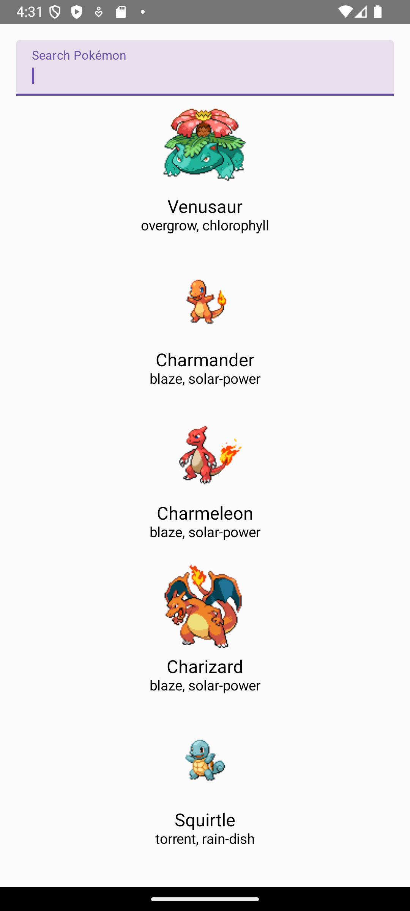

# Pokémon Fetcher App

This Android app allows users to fetch and display data about Pokémon using the Pokémon API. Users can search for Pokémon by name and retrieve details, including its image and abilities.

## Features

- Fetch Pokémon data by name
- Display Pokémon image, name, and abilities
- Error handling for invalid inputs
- Search functionality to filter Pokémon

## Screenshots

 <!-- Screenshot of the app -->
